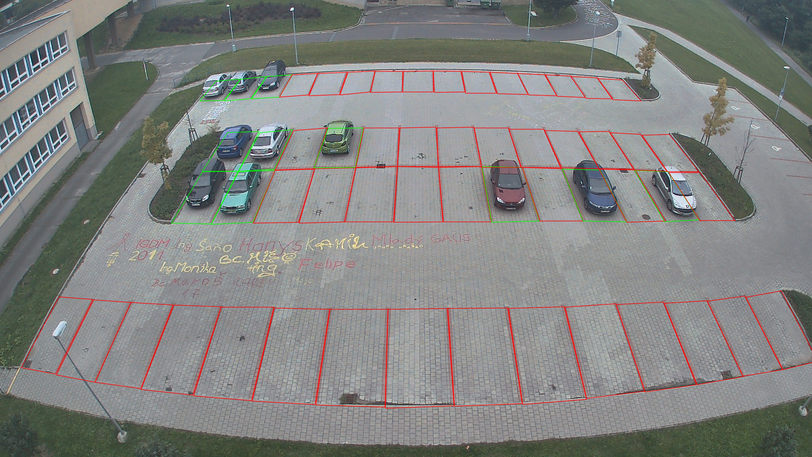

# Parking Lot Occupancy Analysis
This project solves parking lot occupancy analysis using various computer vision techniques, such as:

- Edge Detection, HOG, HAAR, LBP
- Fully Connected Neural Networks
- Convolutional Neural Networks
- Transfer Learning with Pre-trained CNN Models
- Object Detection Models (YOLO, SSD, Faster R-CNN)
- Vision Transformers (ViT)

It also includes some data augmentation techniques, such as Transforms and GAN.

## Repository Structure
- `models/`: Contains implementations of different models -- either custom ones or pre-trained architectures adjusted for fine-tuning.
- `detectors/`: Wraps object detection models in a consistent interface for easy experimentation.
- `notebooks/`: Jupyter notebooks for model training.
- `trained/`: Trained model weights.
- `yolo/`: Everything related to YOLO.

## Showcase
