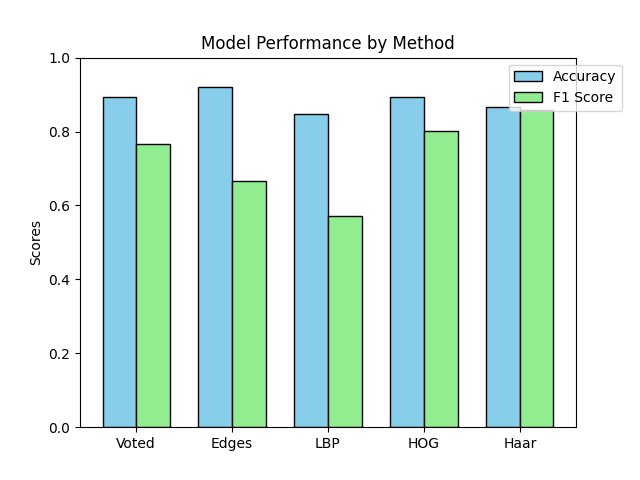

# Classifying using Edges, LBP, HOG and Haar

### test_images/test1.jpg
| Method | Accuracy | F1 |
|--------|----------|----------|
| Base   | 1.0      | 1.0      |
| Edge   | 1.0      | 1.0      |
| LBP    | 0.9286   | 0.6667   |
| HOG    | 0.9821   | 0.9091   |
| HAAR   | 0.9821   | 0.8889   |

### test_images/test10.jpg
| Method | Accuracy | F1 |
|--------|----------|----------|
| Base   | 1.0      | 1.0      |
| Edge   | 0.7857   | 0.5714   |
| LBP    | 0.9821   | 0.9524   |
| HOG    | 0.9464   | 0.8800   |
| HAAR   | 1.0      | 1.0      |

### test_images/test11.jpg
| Method | Accuracy | F1 |
|--------|----------|----------|
| Base   | 0.9643   | 0.9796   |
| Edge   | 0.7679   | 0.8506   |
| LBP    | 0.9464   | 0.9691   |
| HOG    | 0.9464   | 0.9709   |
| HAAR   | 0.9643   | 0.9796   |

### test_images/test12.jpg
| Method | Accuracy | F1 |
|--------|----------|----------|
| Base   | 0.8036   | 0.5600   |
| Edge   | 0.8036   | 0.5217   |
| LBP    | 0.7679   | 0.5185   |
| HOG    | 0.9107   | 0.8718   |
| HAAR   | 0.8929   | 0.8421   |

### test_images/test13.jpg
| Method | Accuracy | F1 |
|--------|----------|----------|
| Base   | 0.8929   | 0.5000   |
| Edge   | 0.9107   | 0.0000   |
| LBP    | 0.8393   | 0.4000   |
| HOG    | 0.6964   | 0.3704   |
| HAAR   | 0.0893   | 0.1639   |

### test_images/test14.jpg
| Method | Accuracy | F1 |
|--------|----------|----------|
| Base   | 1.0      | 1.0      |
| Edge   | 0.9464   | 0.4000   |
| LBP    | 0.9821   | 0.6667   |
| HOG    | 0.8750   | 0.2222   |
| HAAR   | 0.5536   | 0.0741   |

### test_images/test15.jpg
| Method | Accuracy | F1 |
|--------|----------|----------|
| Base   | 0.9643   | 0.5000   |
| Edge   | 0.9821   | 0.6667   |
| LBP    | 0.9643   | 0.5000   |
| HOG    | 0.9107   | 0.4444   |
| HAAR   | 0.0357   | 0.0690   |

### test_images/test16.jpg
| Method | Accuracy | F1 |
|--------|----------|----------|
| Base   | 1.0      | 1.0      |
| Edge   | 1.0      | 1.0      |
| LBP    | 0.9464   | 0.0000   |
| HOG    | 0.8214   | 0.0000   |
| HAAR   | 0.9821   | 0.0000   |

### test_images/test17.jpg
| Method | Accuracy | F1 |
|--------|----------|----------|
| Base   | 0.8750   | 0.9333   |
| Edge   | 0.9286   | 0.9630   |
| LBP    | 0.6964   | 0.8211   |
| HOG    | 1.0      | 1.0      |
| HAAR   | 0.8036   | 0.8911   |

### test_images/test18.jpg
| Method | Accuracy | F1 |
|--------|----------|----------|
| Base   | 0.9821   | 0.0000   |
| Edge   | 0.9821   | 0.0000   |
| LBP    | 0.9286   | 0.0000   |
| HOG    | 0.7857   | 0.0000   |
| HAAR   | 0.0179   | 0.0351   |

### test_images/test19.jpg
| Method | Accuracy | F1 |
|--------|----------|----------|
| Base   | 0.9107   | 0.4444   |
| Edge   | 1.0      | 1.0      |
| LBP    | 0.8214   | 0.1667   |
| HOG    | 0.7857   | 0.2500   |
| HAAR   | 0.0893   | 0.0727   |

### test_images/test2.jpg
| Method | Accuracy | F1 |
|--------|----------|----------|
| Base   | 0.7679   | 0.8000   |
| Edge   | 0.6786   | 0.6897   |
| LBP    | 0.6250   | 0.6769   |
| HOG    | 0.9107   | 0.9383   |
| HAAR   | 0.9464   | 0.9610   |

### test_images/test20.jpg
| Method | Accuracy | F1 |
|--------|----------|----------|
| Base   | 0.8929   | 0.2500   |
| Edge   | 0.9821   | 0.6667   |
| LBP    | 0.8571   | 0.2000   |
| HOG    | 0.8393   | 0.3077   |
| HAAR   | 0.0357   | 0.0690   |

### test_images/test21.jpg
| Method | Accuracy | F1 |
|--------|----------|----------|
| Base   | 0.9286   | 0.3333   |
| Edge   | 0.9821   | 0.6667   |
| LBP    | 0.9107   | 0.2857   |
| HOG    | 0.8750   | 0.3636   |
| HAAR   | 0.0357   | 0.0690   |

### test_images/test22.jpg
| Method | Accuracy | F1 |
|--------|----------|----------|
| Base   | 0.9643   | 0.5000   |
| Edge   | 0.9821   | 0.6667   |
| LBP    | 0.9107   | 0.2857   |
| HOG    | 0.8929   | 0.4000   |
| HAAR   | 0.0357   | 0.0690   |

### test_images/test23.jpg
| Method | Accuracy | F1 |
|--------|----------|----------|
| Base   | 0.8929   | 0.0000   |
| Edge   | 0.9643   | 0.0000   |
| LBP    | 0.8750   | 0.0000   |
| HOG    | 0.7321   | 0.0000   |
| HAAR   | 0.0357   | 0.0690   |

### test_images/test24.jpg
| Method | Accuracy | F1 |
|--------|----------|----------|
| Base   | 1.0      | 1.0      |
| Edge   | 0.9464   | 0.0000   |
| LBP    | 1.0      | 1.0      |
| HOG    | 0.9643   | 0.0000   |
| HAAR   | 0.5357   | 0.0000   |

### test_images/test3.jpg
| Method | Accuracy | F1 |
|--------|----------|----------|
| Base   | 0.7143   | 0.7333   |
| Edge   | 0.7143   | 0.7037   |
| LBP    | 0.5714   | 0.6250   |
| HOG    | 0.8750   | 0.9091   |
| HAAR   | 0.8393   | 0.8767   |

### test_images/test4.jpg
| Method | Accuracy | F1 |
|--------|----------|----------|
| Base   | 0.7857   | 0.8571   |
| Edge   | 0.6607   | 0.7532   |
| LBP    | 0.5357   | 0.6750   |
| HOG    | 0.9286   | 0.9600   |
| HAAR   | 0.9821   | 0.9897   |

### test_images/test5.jpg
| Method | Accuracy | F1 |
|--------|----------|----------|
| Base   | 0.8393   | 0.5714   |
| Edge   | 0.8393   | 0.5714   |
| LBP    | 0.7500   | 0.4167   |
| HOG    | 0.8036   | 0.7317   |
| HAAR   | 0.9643   | 0.9333   |

### test_images/test6.jpg
| Method | Accuracy | F1 |
|--------|----------|----------|
| Base   | 0.7857   | 0.6471   |
| Edge   | 0.7857   | 0.6471   |
| LBP    | 0.6429   | 0.4737   |
| HOG    | 0.8929   | 0.8846   |
| HAAR   | 0.9464   | 0.9333   |

### test_images/test7.jpg
| Method | Accuracy | F1 |
|--------|----------|----------|
| Base   | 0.8214   | 0.8718   |
| Edge   | 0.7857   | 0.8421   |
| LBP    | 0.6429   | 0.7222   |
| HOG    | 0.9643   | 0.9778   |
| HAAR   | 0.9821   | 0.9885   |

### test_images/test8.jpg
| Method | Accuracy | F1 |
|--------|----------|----------|
| Base   | 0.8929   | 0.8571   |
| Edge   | 0.9107   | 0.8837   |
| LBP    | 0.7679   | 0.6829   |
| HOG    | 0.8750   | 0.8727   |
| HAAR   | 0.9643   | 0.9583   |

### test_images/test9.jpg
| Method | Accuracy | F1 |
|--------|----------|----------|
| Base   | 0.8214   | 0.8649   |
| Edge   | 0.7500   | 0.7941   |
| LBP    | 0.6250   | 0.6957   |
| HOG    | 0.9107   | 0.9425   |
| HAAR   | 0.9464   | 0.9639   |

## Median of all
| Method | Median Accuracy | Median F1 |
|--------|-----------------|-----------|
| Base   | 0.8929          | 0.7667    |
| Edge   | 0.9196          | 0.6667    |
| LBP    | 0.8482          | 0.5718    |
| HOG    | 0.8929          | 0.8018    |
| HAAR   | 0.8661          | 0.8594    |

