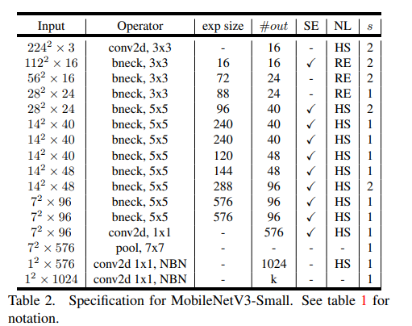
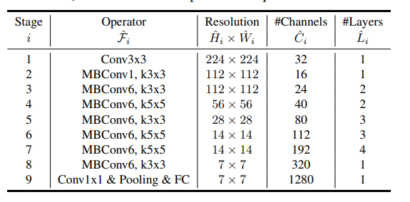
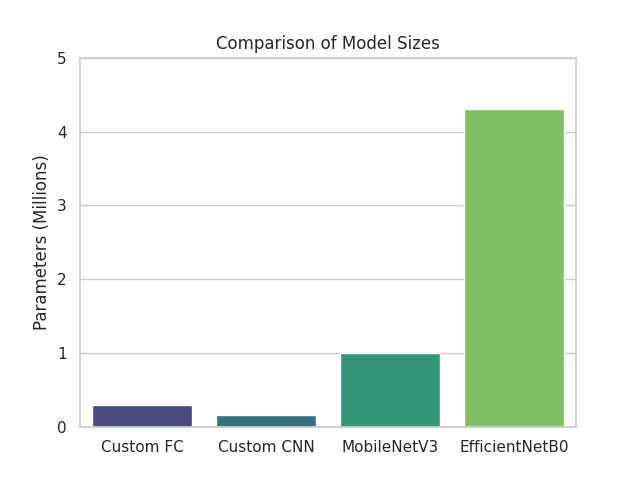

# Augmentations
- Jitter (brightness, contrast, saturation = 0.4; hue = 0.2)
- Resize (40, 60) for my models; (244, 244) for transfer learning
- Tensor

# Own fully connected neural network
Very basic architecture:

```
----------------------------------------------------------------
        Layer (type)               Output Shape         Param #
================================================================
            Linear-1                  [-1, 128]         307,328
       BatchNorm1d-2                  [-1, 128]             256
              ReLU-3                  [-1, 128]               0
            Linear-4                   [-1, 64]           8,256
       BatchNorm1d-5                   [-1, 64]             128
              ReLU-6                   [-1, 64]               0
            Linear-7                    [-1, 1]              65
================================================================
```

Used optimizer is SGD with momentum 0.9 and lr 0.001. Also tried Adagrad and AdamW, but they
were performing a bit worse. The number of training epochs was always 100, which was by no means necessary.

**Parameters: 315,033**

**Accuracy: 0.865**

# Own convolutional neural network
Architecture stays the same in all experiments (because using Optuna would burn my already charred notebook):

Optimizer is always AdamW; other ones were performing worse. The number of epochs was always 100, but it was by no means necessary.
The only thing that changes is kernel sizes, strides, dropouts and learning rate.

Architecture:

```
----------------------------------------------------------------
        Layer (type)               Output Shape         Param #
================================================================
            Conv2d-1           [-1, 32, 20, 10]             832
       BatchNorm2d-2           [-1, 32, 20, 10]              64
         MaxPool2d-3            [-1, 32, 10, 5]               0
              ReLU-4            [-1, 32, 10, 5]               0
            Conv2d-5             [-1, 64, 4, 2]          18,496
       BatchNorm2d-6             [-1, 64, 4, 2]             128
              ReLU-7             [-1, 64, 4, 2]               0
            Conv2d-8            [-1, 128, 3, 1]          32,896
       BatchNorm2d-9            [-1, 128, 3, 1]             256
             ReLU-10            [-1, 128, 3, 1]               0
          Flatten-11                  [-1, 384]               0
           Linear-12                  [-1, 256]          98,560
          Dropout-13                  [-1, 256]               0
             ReLU-14                  [-1, 256]               0
           Linear-15                   [-1, 64]          16,448
          Dropout-16                   [-1, 64]               0
             ReLU-17                   [-1, 64]               0
           Linear-18                    [-1, 1]              65
================================================================
```

### Changed hyperparameters
| Kernel Sizes | Strides   | LR      | Dropouts    | Accuracy |
|--------------|-----------|---------|-------------|----------|
| (3, 3, 3)    | (1, 1, 1) | 0.001   | (0.4, 0.2)  | 0.642    |
| (5, 3, 2)    | (3, 2, 1) | 0.0001  | (0.3, 0.3)  | 0.729    |
| (5, 3, 2)    | (3, 2, 2) | 0.00001 | (0.3, 0.2)  | 0.922    |

**Parameters: 167,057**

**Accuracy: 0.922**

# Transfer Learning: MobileNetV3 Small
I picked small MobileNetV3 because it was by far the fastest model to train. The 
parameters : accuracy ratio is very good.

I performed few changes to the architecture:
- Changed classifier to my own (two linear layers, dropout, one neuron output)
- Froze the whole model except the classifier

For training, I used AdamW with lr 0.0001. The number of epochs was 10, because
the model is already pretrained (and also pretty big for training on CPU). After that, I fined tuned it again, with lr 0.00005 for 5 epochs.
And it just worked.



**Parameters: 1,042,113**

**Accuracy: 0.975**

Src: https://arxiv.org/pdf/1905.02244

# Transfer Learning: EfficientNetB0
In order to protect nature and our household's electricity bills, I picked another very lite model: EfficientNetB0.
It has 4M params, which is still pretty okay. The changes to the architecture were the same
as for the MobileNetV3. The training was also the same -- first 10 epochs with lr 0.0001, then some more epochs with lower
learning rate to catch some weird edge cases (nighttime + parking spot under the lamp, sunny + parking spot in the shadow of a tree, etc...)
And again, it just worked -- as well as MobileNetV3 ;)



**Parameters: 4,011,905**

**Accuracy: 0.981**

Src: https://arxiv.org/pdf/1905.11946

# To sum it up
The best model is EfficientNetB0, which is also the biggest one. Still, it is pretty small and fast to train compared to models like VGG or ResNet.
Getting 90%+ accuracy is pretty simple to do, even with my own architecture and small networks. After that, getting better accuracy requires
either transfer learning on complex architecture or very big models (preferably both).




